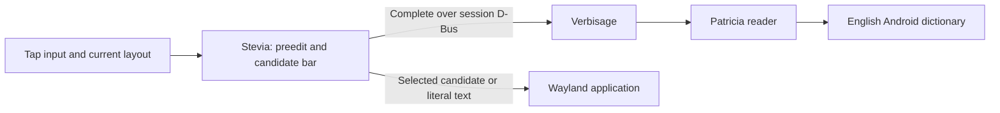

# Completion first, gesture input next

The current-word trial has one new path:

Stevia owns key events, layout selection, input purpose, focus, preedit,
candidate selection and text commitment. Verbisage owns dictionary access and
language queries and joint ranking of prefixes and single-edit corrections.
The Patricia reader supplies prefix traversal, word flags,
stored probabilities and ngram context. The dictionary is a separate data
package. This division lets tap completion use the same language service that
later gesture input can use.

The first release requested prefixes and corrections separately. Version 1.2
uses one bounded ranked response so an early prefix quota cannot discard a
useful spelling correction, and the bar does not reorder when a second reply
arrives. Stevia still owns the literal first choice and commits it unchanged
on Space or Enter. Dictionary ranks and edit weights are heuristics; this does
not reproduce Android's full correction model.

Layouts and gestures need a shared geometry contract: a recognizer must know
which characters occupy which key positions, including the active layer and
layout. They do not need to be one implementation. A later Stevia change can
collect a touch path and provide a snapshot of that geometry to Drift Type,
then present its results through the existing candidate/preedit path.

Drift Type is packaged here as a Rust source dependency. It is not wired into
Stevia. Its current candidate API borrows word strings; Patricia yields owned
strings, so the integration needs retained candidate storage or an agreed API
change. Candidate search and scoring should be batched: D-Bus calls for every
trie node or candidate would turn local matching into an IPC bottleneck.

The proposed next milestone runs recognition beside Patricia in Verbisage,
with one bounded layout/path request per completed swipe. It does not require
replacing Stevia's layout definitions or Wayland text handling. Recognition
quality, candidate storage and latency need measurement before that design
is enabled for regular use.

The updated Patricia API already exposes ngrams and prepared context scores.
Verbisage's new adapter implements context prediction, but the initial Stevia
adapter uses prefix completion and spelling only. It does not automatically
correct text, learn words, predict the next word, or recognize swipes.
